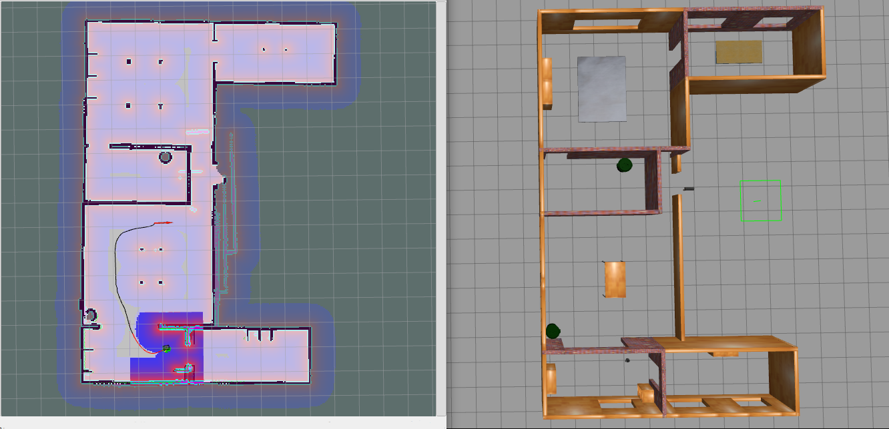
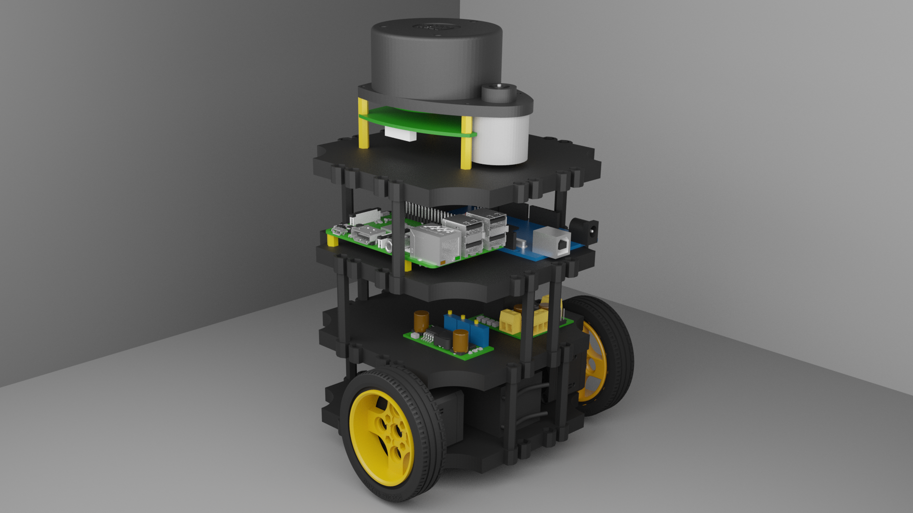
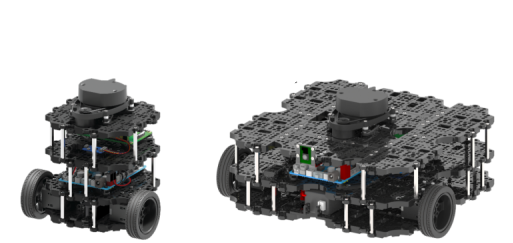

# SLAMBot

[](https://github.com/IEEE-NITK/SLAMBot/issues)
[](https://github.com/IEEE-NITK/SLAMBot/blob/main/LICENSE)


<br>
<details>
  <summary>Table of Contents</summary>
    <ol>
        <li>
            <a href="#introduction">Introduction</a>
            <ul>
                <li><a href="#technologies-used">Technologies Used</a></li>
            </ul>
        </li>
        <li>
            <a href="#literature-survey">Literature Survey</a>
            <ul>
                <li><a href="#robot-operating-system-ros">Robot Operating System (ROS)</a></li>
                <li><a href="#basic-terminologies-in-ros">Basic Terminologies in ROS</a></li>
                <li><a href="#turtlebot">Turtlebot</a></li>
                <li><a href="#lidar">LIDAR</a></li>
                <li><a href="#Raspberry-pi">Raspberry Pi</a></li>
                <li><a href="#Arduino-Mega">Arduino Mega</a></li>
            </ul>
        </li>
        <li>
            <a href="#getting-started">Getting Started</a>
            <ul>
            <li><a href="#prerequisites">Prerequisites</a></li>
            <li><a href="#installation">Installation</a></li>
            </ul>
        </li>
        <li>
            <a href="#user-guide">User Guide</a>
                <ul>
                    <li><a href="#launching-gazebo-simulation">Launching Gazebo Simulation</a></li>
                    <li><a href="#slam-creating-a-map">SLAM: Creating a Map</a></li>
                    <li><a href="#saving-the-map">Saving the Map</a></li>
                    <li><a href="#slam-autonomous-navigation">SLAM: Autonomous Navigation</a></li>
                </ul>    
        </li>
        <li>
            <a href="#the-robot">The Robot</a> 
        </li>
        <li>
            <a href="#project-mentors">Project Mentors</a></li>
        </li>
        <li>
            <a href="#project-members">Project Members</a></li>
        </li> 
        <li>
            <a href="#License">License</a></li>
        </li>    
    </ol>
</details>

<hr>

## Introduction

<b>SLAM</b> (<b>S</b>imultaneous <b>L</b>ocalization <b>A</b>nd <b>M</b>apping) is an essential technology used in robotics that helps robots to estimate their position and orientation on a map while creating the map of the environment to carry out autonomous activities. 


*Turtlebot using SLAM to navigate across a map*

This project aims to put together a mobile robot similar to a TurtleBot. A TurtleBot is a low-cost, personal robot kit with open source software.


*SLAMBot*

### Technologies Used
[](https://skills.thijs.gg)

## Literature Survey

### Robot Operating System (ROS)

ROS is an open-source, meta-operating system to operate robots. ROS provides the services of an operating system such as hardware abstraction, low-level device control, implementation of commonly-used functionality, message-passing between processes, and package management. ROS also provides tools and libraries for obtaining, building, writing and running code across multiple computers. ROS currently only runs on Unix-based platforms. Software for ROS is primarily tested on Ubuntu and Mac OS X systems, though the ROS community has been contributing support for Fedora, Gentoo, Arch Linux and other Linux platforms.

### Basic Terminologies in ROS:

* Nodes: A node is an executable that uses ROS to communicate with other nodes. A ROS Node can be a Publisher or a Subscriber. A Publisher puts the messages of a standard message type to a particular topic. The Subscriber, on the other hand, subscribes to the topic and receives the messages that are published to the topic.
* Messages: ROS data type used upon subscribing or publishing to a topic.
* Topics: Nodes can publish messages to a topic as well as subscribe to a topic to receive messages.
* Master: Name service for ROS (i.e. helps nodes find each other)
* rosout: ROS equivalent of stdout/stderr
* roscore: Master + rosout + parameter server (parameter server will be introduced later)

Client libraries needed for this project: 
* rospy: python client library 
* roscpp: c++ client library

### Turtlebot:

TurtleBot3 is a small, affordable, programmable, ROS-based mobile robot for use in education, research, hobby, and product prototyping. The TurtleBot’s core technology is SLAM, Navigation and Manipulation, making it suitable for home service robots.
<p>
     
    <br>
    <em>Turtlebot3 Models - Burger and Waffle</em>
</p>

### LIDAR:

A <b>LIDAR</b> (<b>LI</b>ght <b>D</b>etection <b>A</b>nd <b>R</b>anging) is a sensor that uses light in the form of a pulsed laser to calculate the relative distances of various objects. This 3D scanning system calculates how long it takes for beams of light to hit an object or surface and reflect back to the laser scanner using the velocity of light. The observed LIDAR data is then used to generate precise, three dimensional information about the environment of the robot and navigate smoothly while avoiding the obstacles.

### Raspberry Pi:

The Raspberry Pi is an affordable single-board computer that operates in the ecosystem, it runs Linux and is extensively used to develop programming skilld or build hardware projects. It is a fast and versatile microprocessing board along with a set of GPIO(general purpose input/output) pins, allowing one to control electronic components for physical computing.

### Arduino Mega:

Arduino is an open-source electronics platform based on easy-to-use hardware and software intended for applications in interactive projects. It is a single-board microcontroller which senses the environment by receiving inputs from sensors and can be used to control the lights, motors and other actuators of the robot. One can even command the Arduino by coding in the Arduino programming language and using the Arduino development environment.

## Getting Started

### Prerequisites

* Ubuntu 20.04
* ROS Noetic 

> For installing ROS refer to [ROS Wiki](http://wiki.ros.org/noetic/Installation)

### Installation

Create a catkin workspace

```bash
mkdir ros_ws
cd ros_ws
mkdir src
catkin build
```
To automatically source this workspace every time a new shell is launched, run these commands

```bash
echo "source ~/ros_ws/devel/setup.bash" >> ~/.bashrc
source ~/.bashrc
```

Clone the repository in the `src` folder in the catkin workspace.

```bash
cd ~/ros_ws/src
git clone https://github.com/IEEE-NITK/SLAMBot.git
```

Navigate back to the workspace folder and build the packages.

```bash
cd ~/ros_ws
catkin build
```

## User Guide

### Launching Gazebo Simulation

To launch the gazebo simulation use the command

```bash
roslaunch slambot_simulation slambot_simulation.launch
```
or
```bash
roslaunch slambot_simulation turtlebot_simulation.launch
```

To move the robot around, we need to launch teleoperation keyboard:
```bash
roslaunch turtlebot3_teleop turtlebot3_teleop_key.launch
```
### SLAM: Creating a Map

Before we can autonomously drive around any world, we need to provide the robot with a map which will be used to localize (position) the robot relative to obstacles or features defined in the map. We will create a new map of the default world by doing the following:

1. Launch the world in Gazebo
2. Launch the mapping node
3. Drive around and collect data from the robot's sensors until we have a (nearly) complete and accurate map.

After launching the gazebo simulation and teleoperation, use the following command to create a map using gmapping algorithm:

```bash
roslaunch turtlebot3_slam turtlebot3_slam.launch slam_methods:=gmapping
```

Now, with the terminal running the teleop_key selected, drive the robot around using the W, A, D, X and S keys.

Once your map has all of the features defined (black for walls or obstacles, white for no obstacles, and gray/transparent for unknown regions), we need to save the map.

### Saving the Map

In a new terminal, run:

```bash
rosrun map_server map_saver -f ~/map
```

This will create two files:
* map.pgm - the image containing the white, gray, and black regions.
* map.yaml - the configuration data for the map.pgm image.

### SLAM: Autonomous Navigation

Now that we have a map of the world, we can drive the robot autonomously inside the world. To do this, we will:

1. Launch the necessary scripts
2. Set an initial pose estimate to align the map relative to the current sensor data (i.e. perform an initial localization)
3. Set target (goal) positions and orientations for the robot to drive to
4. Have the robot navigate to the goal autonomously

Let's launch the following scripts:
```bash
roslaunch turtlebot3_gazebo turtlebot3_world.launch
```
```bash
roslaunch turtlebot3_navigation turtlebot3_navigation.launch map_file:=$HOME/map.yaml
```
Next, in rviz, we will select 2D Pose Estimate:


## The Robot

The robot model used in this project is a simple differential drive comprising of 2 wheels mounted on their motor along with a roller castor for additional base support.

The robot consists of 4 layers:

* Bottom-most layer: The propulsion group comprising of battery and motors.
* Second layer: It consists of the power distribution board along with motor drivers.
* Third layer: This layer has an Raspberry Pi, which is a single board computer, along with an Arduino Mega microcontroller.
* Top-most layer: It comprises of the LIDAR

The above mentioned plates are 3D printed parts which are further assembled with the electronic hardware using screws and supports to ensure stability of the structure.

The design of the bot is created on Fusion 360, a commercial CAD and CAM software. It is then directly exported as a URDF (Unified Robotic Description Format) file, accompanied by a .stl file of the model alongside a .launch and .yaml file to simulate it on Gazebo. The URDF is an XML file format for specifying the geometry and organization of robots in ROS and can be generated using URDF_Exporter. 

The robot is simulated in Gazebo, a powerful, open-source 3D robotics simulator with the ability to accurately and efficiently generate synthetic sensor data and offers realistic environments with high fidelity sensors streams to construct and interact with simulations. Within Gazebo, a physics engine is used to define realistic elements of an environment such as illumination, gravity and inertia.

## Project Mentors:

1. [Shivani Chanda](https://github.com/Shivani-Chanda)
2. [Spandan Patkar](https://github.com/SpandanPatkar)
3. [Sunaina Sunil](https://github.com/SunainaSunil)

## Project Members:

1. [Joel Jojo Painuthara](https://github.com/JoelJojoP)
2. [Pooja M](https://github.com/pooja-murugiah)
3. [Sakshi Bothra](https://github.com/Sakshi-1606)

## License:

This repository is licensed under the 
