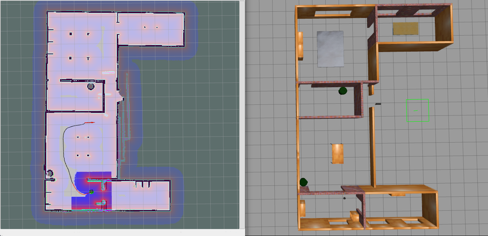
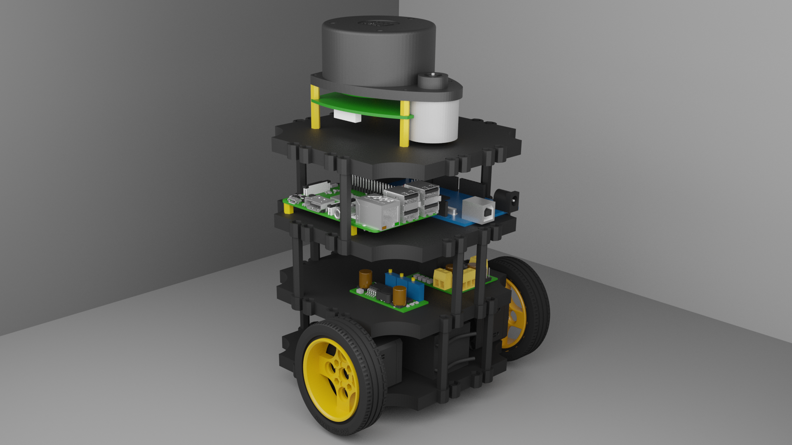

# SLAMBot

[](https://github.com/IEEE-NITK/SLAMBot/issues)
[](https://github.com/IEEE-NITK/SLAMBot/blob/main/LICENSE)


### Table of Contents
<ol>
    <li>
        <a href="#introduction">Introduction</a>
        <ul>
            <li><a href="#technologies-used">Technologies Used</a></li>
        </ul>
    </li>
    <li>
        <a href="#getting-started">Getting Started</a>
        <ul>
        <li><a href="#prerequisites">Prerequisites</a></li>
        <li><a href="#installation">Installation</a></li>
        <li><a href="#setup">Setup</a></li>
        </ul>
    </li>
    <li>
         <a href="#getting-started part 2">Getting Started part 2</a>
         <ul>
         <li><a href="#launching gazebo">Launching gazebo</a></li>
         <li><a href="#SLAM Creating a Map">SLAM: Creating a Map</a></li>
         <li><a href="#Save the Map">Save the Map</a></li>
         <li><a href="#SLAM Autonomous Navigation">SLAM: Autonomous Navigation</a></li>
    </li>
</ol>

<hr>

## Introduction

<b>SLAM</b> (<b>S</b>imultaneous <b>L</b>ocalization <b>A</b>nd <b>M</b>apping) is an essential technology used in robotics that helps robots to estimate their position and orientation on a map while creating the map of the environment to carry out autonomous activities. 


*Turtlebot using SLAM to navigate across a map*

This project aims to put together a mobile robot similar to a TurtleBot. A TurtleBot is a low-cost, personal robot kit with open source software.


*SLAMBot*

### Technologies Used
[](https://skills.thijs.gg)

## Getting Started

### Prerequisites

* Ubuntu 20.04
* ROS Noetic

### Installation

Clone this repository in a ROS workspace and build the packages using `catkin build`.

Launch the TurtleBot3 simulation using the following command:
```bash
roslaunch slambot_simulation turtlebot_simulation.launch
```

Basic move code C++ template is in [this](/slambot_simulation/src/turtlebot3_move.cpp) file. C++ code needs to be compiled in order to run. You can compile by adding your C++ file to CMakeLists.txt like [this](/slambot_simulation/CMakeLists.txt?plain=1#L141-L143), and then running `catkin build`.


Arduino code for uploading to your embedded board is [here](/slambot_arduino/differential_drive/differential_drive.ino). Compile and upload the code using Arduino IDE. Run the rosserial server node on your connected computer to connect the ROS node on the board. This node needs to be running to "*activate*" your ROS node on your arduino board.

```bash
rosrun rosserial_arduino serial_node.py
```
### Setup

The upcoming commands are to edit the bashrc file so every time you open a new terminal, the terminal will have the right variables pre-defined. This command adds sourcing the devel/setup.bash file so new packages installed through apt are recognized by Catkin and your terminal:

```bash
source ~/catkin_ws/devel/setup.bash
```

The default model used in our TurtleBot simulation to be the Burger model:
```bash
export TURTLEBOT3_MODEL=burger
```

Now source the .bashrc for these things to take effect:
```bash
source ~/.bashrc
```
## Getting Started part 2
### Launching gazebo

We can launch the Turtlebot in our respective world with(replace house with our world)
```bash
roslaunch turtlebot3_gazebo turtlebot3_house.launch
```
To drive the TurtleBot around, we need to launch the TurtleBot Teleop node:
```bash
roslaunch turtlebot3_teleop turtlebot3_teleop_key.launch
```
### SLAM: Creating a Map

Before we can autonomously drive around any world, we need to provide the robot with a map which will be used to localize (position) the robot relative to obstacles or features defined in the map. We will create a new map of the default world by doing the following:

1. Launch the world in Gazebo
2. Launch the mapping node
3. Launch the mapping node
4. Drive around and collect data from the robot's sensors until we have a (nearly) complete and accurate map.

We will use the following commands to launch the files:
```bash
roslaunch turtlebot3_gazebo turtlebot3_world.launch
````
```bash
roslaunch turtlebot3_slam turtlebot3_slam.launch slam_methods:=gmapping
```
```bash
roslaunch turtlebot3_teleop turtlebot3_teleop_key.launch
```
Now, with the terminal tab or window running the teleop node selected, drive the robot around using the W A D X and S keys.

Once your map has all of the features defined (black for walls or obstacles, white for no obstacles, and gray/transparent for unknown regions), we need to save the map.

### Save the Map

n a new terminal tab or window, run:
```bash
rosrun map_server map_saver -f ~/map
```
Now we have created two files:
1. map.pgm - the image containing the white, gray, and black regions.
2. map.yaml - the configuration data for the map.pgm image.

### SLAM: Autonomous Navigation

Now that we have a map of our world, we can drive autonomously inside the world and the TurtleBot should avoid all obstacles in the map. To do this, we will:

1. Launch the necessary scripts
2. Set an initial pose estimate to align the map relative to the current sensor data (i.e. perform an initial localization)
3. Set target (goal) positions and orientations for the robot to drive to
4. Have the robot navigate to the goal autonomously

Let's launch the following scripts:
```bash
roslaunch turtlebot3_gazebo turtlebot3_world.launch
```
```bash
roslaunch turtlebot3_navigation turtlebot3_navigation.launch map_file:=$HOME/map.yaml
```
Next, in rviz, we will select 2D Pose Estimate:


